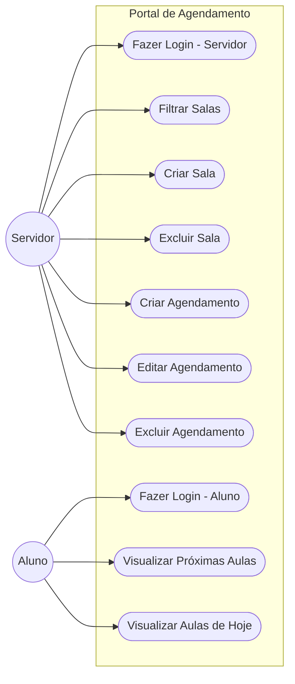
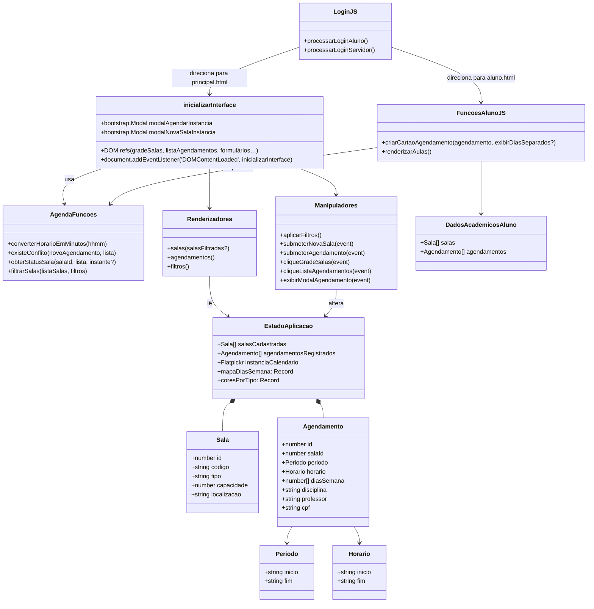

# Arquitetura

## Casos de Uso

## Diagrama de Classes

## Estrutura dos Scripts

- `js/script.js` contém `AgendaFuncoes`, `estadoAplicacao`, `renderizadores`, `manipuladores` e o `inicializarInterface`, que integra Bootstrap e Flatpickr.
- `js/aluno.js` possui o módulo de dados acadêmicos e funções de renderização para o painel do aluno.
- `js/login.js` lida apenas com os formulários de autenticação simulada.