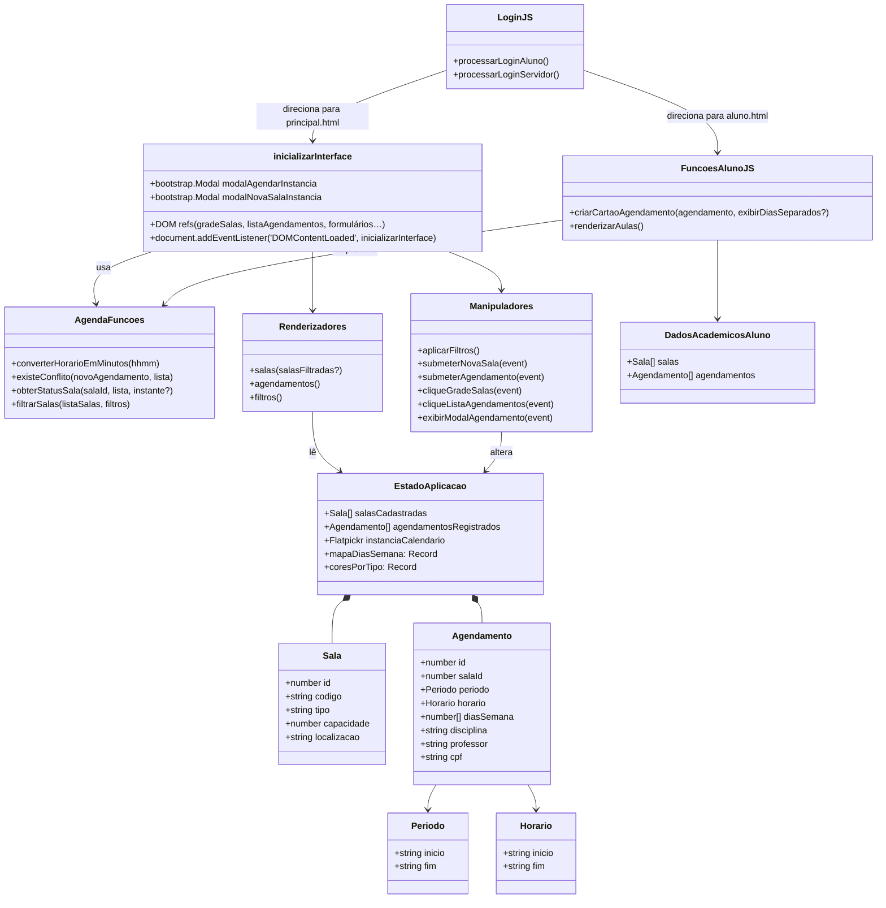

# Arquitetura

## Casos de Uso

```mermaid
usecaseDiagram
    actor Servidor
    actor Aluno

    rectangle "Portal de Agendamento" {
        Servidor --> (Fazer Login)
        Servidor --> (Filtrar Salas)
        Servidor --> (Criar Sala)
        Servidor --> (Excluir Sala)
        Servidor --> (Criar Agendamento)
        Servidor --> (Editar Agendamento)
        Servidor --> (Excluir Agendamento)

        Aluno --> (Fazer Login)
        Aluno --> (Visualizar Próximas Aulas)
        Aluno --> (Visualizar Aulas de Hoje)
    }
```

## Diagrama de Classes

```mermaid
classDiagram
    direction TB

    class AgendaFuncoes {
        +converterHorarioEmMinutos(hhmm)
        +existeConflito(novoAgendamento, lista)
        +obterStatusSala(salaId, lista, instante?)
        +filtrarSalas(listaSalas, filtros)
    }

    class EstadoAplicacao {
        +Sala[] salasCadastradas
        +Agendamento[] agendamentosRegistrados
        +Flatpickr instanciaCalendario
        +mapaDiasSemana: Record<int,string>
        +coresPorTipo: Record<string,string>
    }

    class Renderizadores {
        +salas(salasFiltradas?)
        +agendamentos()
        +filtros()
    }

    class Manipuladores {
        +aplicarFiltros()
        +submeterNovaSala(event)
        +submeterAgendamento(event)
        +cliqueGradeSalas(event)
        +cliqueListaAgendamentos(event)
        +exibirModalAgendamento(event)
    }

    class inicializarInterface {
        +DOM refs (gradeSalas, listaAgendamentos, formulários…)
        +bootstrap.Modal modalAgendarInstancia
        +bootstrap.Modal modalNovaSalaInstancia
        +document.addEventListener('DOMContentLoaded', inicializarInterface)
    }

    class Sala {
        +number id
        +string codigo
        +string tipo
        +number capacidade
        +string localizacao
    }

    class Agendamento {
        +number id
        +number salaId
        +Periodo periodo
        +Horario horario
        +number[] diasSemana
        +string disciplina
        +string professor
        +string cpf
    }

    class Horario {
        +string inicio
        +string fim
    }

    class Periodo {
        +string inicio
        +string fim
    }

    class DadosAcademicosAluno {
        +Sala[] salas
        +Agendamento[] agendamentos
    }

    class FuncoesAlunoJS {
        +criarCartaoAgendamento(agendamento, exibirDiasSeparados?)
        +renderizarAulas()
    }

    class LoginJS {
        +processarLoginAluno()
        +processarLoginServidor()
    }

    EstadoAplicacao *-- Sala
    EstadoAplicacao *-- Agendamento
    Agendamento --> Periodo
    Agendamento --> Horario

    Renderizadores --> EstadoAplicacao : lê
    Manipuladores --> EstadoAplicacao : altera
    inicializarInterface --> Renderizadores
    inicializarInterface --> Manipuladores
    inicializarInterface --> AgendaFuncoes : usa

    FuncoesAlunoJS --> DadosAcademicosAluno
    FuncoesAlunoJS --> AgendaFuncoes : reaproveita
    LoginJS --> FuncoesAlunoJS : direciona para aluno.html
    LoginJS --> inicializarInterface : direciona para principal.html
```

## Estrutura dos Scripts

- `js/script.js` contém `AgendaFuncoes`, `estadoAplicacao`, `renderizadores`, `manipuladores` e o `inicializarInterface`, que integra Bootstrap e Flatpickr.
- `js/aluno.js` possui o módulo de dados acadêmicos e funções de renderização para o painel do aluno.
- `js/login.js` lida apenas com os formulários de autenticação simulada.